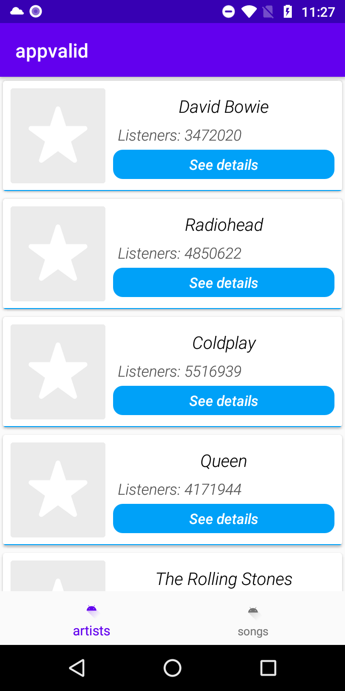
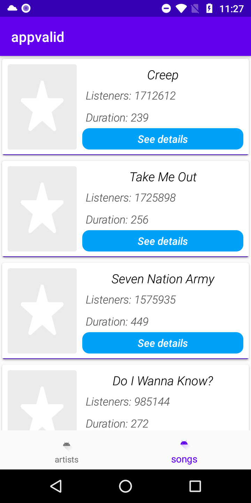
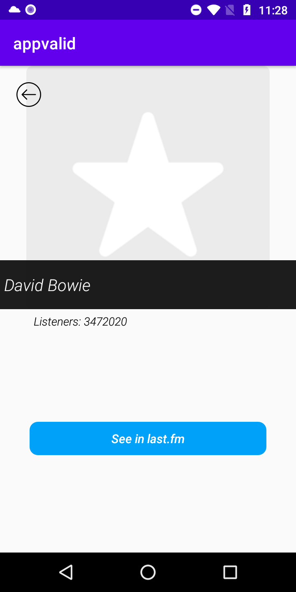
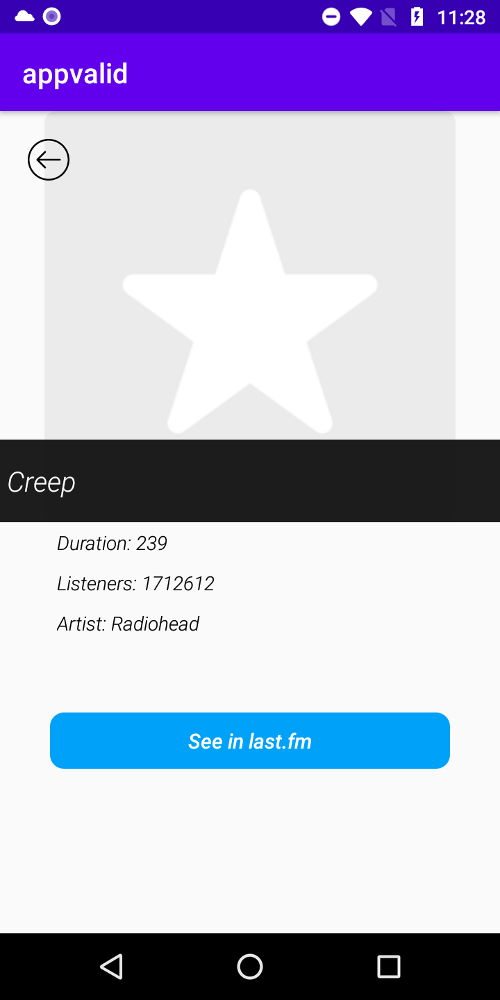

# app-valid

# Requerimientos tecnicos del proyecto
Implementacion de un app para el consumo del Api last.fm y mostrar los listados de los servicios GEO, usando paginacion, mostrando el detalle de cada item con respectivo buscador. Como features deseables para implementar el app se tienen: la interaccion con Apis JSON, el uso de arquitecturas MVP, MVC o MVVM, la persistencia en base de datos  SQL, 
el manejo de flujos de datos con programacion reactiva usando RxJava y RxAndroid, el manejo adecuado de sistemas de versionamiento GIT; ademas, pruebas unitarias o instrumentadas.
El uso de librerias de codigo libre, ya sea: Picasso, Retrofit, Dagger, Otto u OkHttp, la implementacion de algun servicio de firebase.

# Descripcion de responsabilidades de las capas propuestas
## Capa de presentación 
actividades, fragmentos, adaptadores y view models, son responsables de interactuar con el usuario y mostrar los resultados de sus interacciones, ademas de efectuar los llamados a los repositorios de datos. Paquetes:
-adapters: paged adapters y view holders
-view: fragmentos, actividades y viewmodels
## Capa de negocio/ acceso a datos
repositorio, daos, base de datos y api, componentes que son responsables del tratamiento de los datos y el manejo de la lógica de negocio. Paquetes:
-datasource: aloja repositorio, base de datos, daos, caches
-network: aloja api base, servicios y contratos
-models: todos aquellos modelos que permiten el procesamiento de datos.
-utils: aloja constants clase que mantiene las constantes del proyecto
-base: clases para manejar instancia de la aplicacion, la inyeccion de dependencias, y utilidades necesarias para el procesamiento de datos.

##Librerias usadas
-AndroidX
-Retrofit
-RxJava-RxKotlin
-Room
-Paging
-Koin
-Navigation
-Glide

# Screenshots

